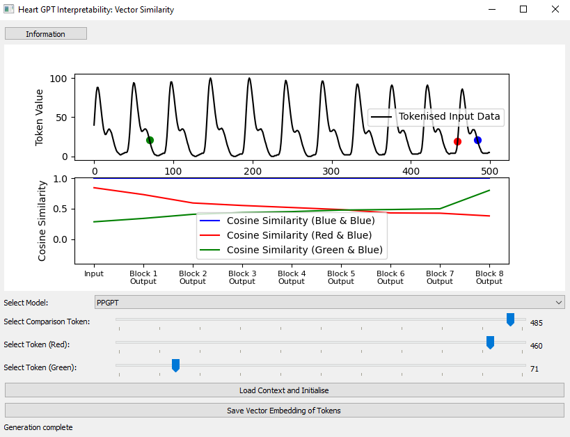

# HeartGPT Python GUIs:
Graphical User Interfaces to enhance the usability of the HeartGPT models (both pre-trained and fine-tuned) from the paper "Interpretable Pre-Trained Transformers for Heart Time-Series Data": 
[Link to the paper](https://www.arxiv.org/abs/2407.20775)

**Generation GUI** 
This GUI allows you to use the base models (trained to predict the next token) to predict next tokens in real-time based on a context which you load in as a csv file.

**Interpretability: Attention Weights** 
This GUI allows you visualise and save attention weights, for each head in each layer of the base model, for a context of their choice.

**Interpretability: Vector Similarity** 
This GUI allows you visualise how the similarity of each token changes as they are updated in vector space by each transformer layer. Users can also save the inputs and outputs of each transformer layer, for a context of their choice, in the 64 dimensional embedding space.

**Atrial Fibrillation** 
This GUI allows users to classify input contexts (either PPG or ECG) as atrial fibrillation. It also displays the change in attention of the final model layer after fine-tuning, as compared to the pretrained model. Attention shifts from predicting the next token to classifying AFib.

**Finger PPG Beat Detection** 
This GUI allows users to automatically detect beats in an uploaded finger PPG signal, and assigns each beat with a confidence value that is proportional to signal quality (height of the model output). In this case, uploaded sequences can be longer than the maximum input length of 500, as the model will break the input down into multiple windows with a shift and process them in batches. 

**Important Information**
The HeartGPT models were trained on ECG sampled at 100Hz, and finger PPG sampled at 50Hz. Inputting signals of different sample frequencies, or different morphologies such as wrist or ear PPG, will have a negative impact on the quality of model inference. 

